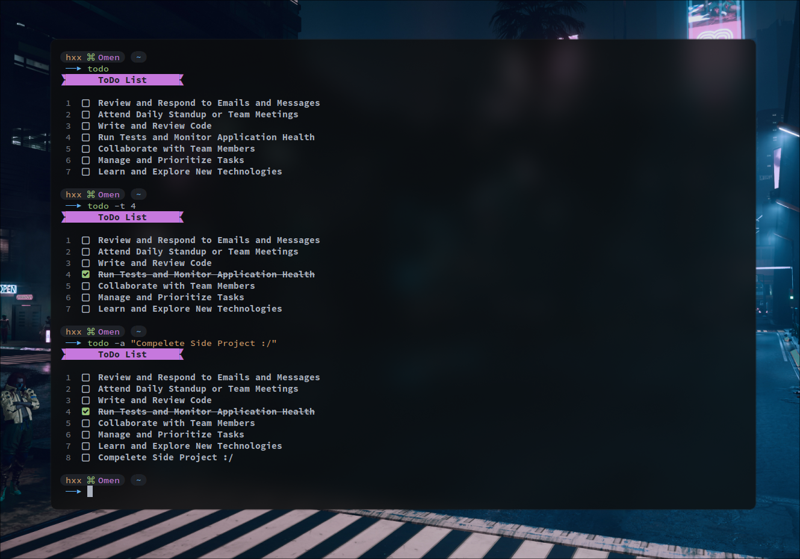

# Todo CLI

<p align="center">
    
</p>

<!--toc:start-->

- [Todo CLI](#todo-cli)
  - [About](#about)
    - [Build From Source](#build-from-source)
      - [Installation](#installation)
      - [Uninstalling](#uninstalling)
    - [Usage](#usage)
  - [License](#license)
  <!--toc:end-->

## About

Todo CLI is a simple to do list to manage your tasks. Written in Go and styled
with [Nerd Fonts](https://www.nerdfonts.com/)

### Build From Source

Install Go and build with this command:

```bash
go build -o todocli # this will output a binary called todocli
```

#### Installation

On traditional distros, you may copy the built binary to `/usr/local/bin`.

```bash
cp -rv todocli /usr/local/bin
```

#### Uninstalling

Removing is quite simple:

```bash
rm -rf /usr/local/bin/todocli
```

### Usage

To add a task to the list

```console
todo -a <Task String>
```

Toggle a task as done or undone

```console
todo -t <Task number>
```

Remove a Task from the list

```console
todo -r <Task Number>
```

Opens editor to edit the raw file of the list (it uses the `$EDITOR` environment
variable)

```console
todo -e
```

## License

All rights belong to [@HxX2](https://github.com/HxX2/todocli).
